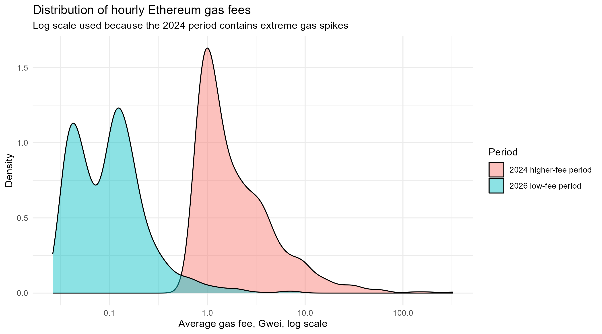
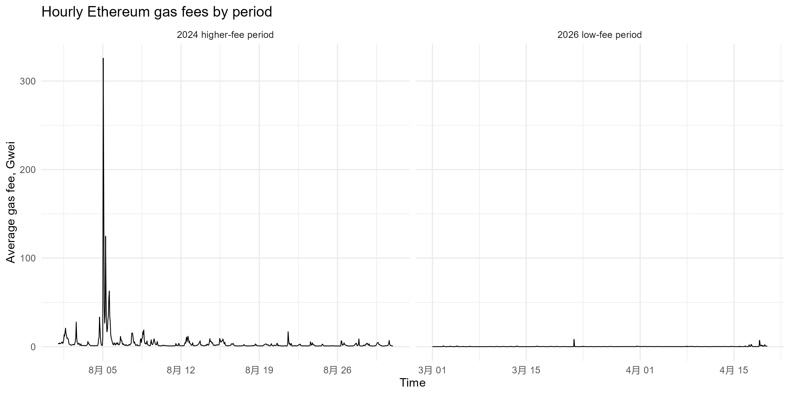
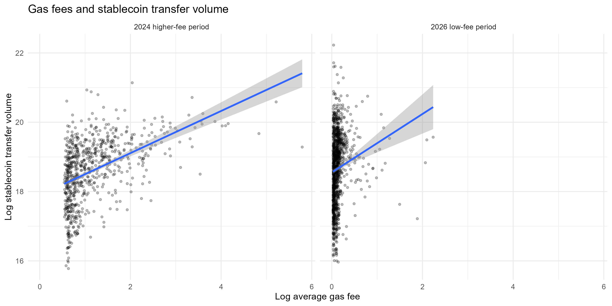
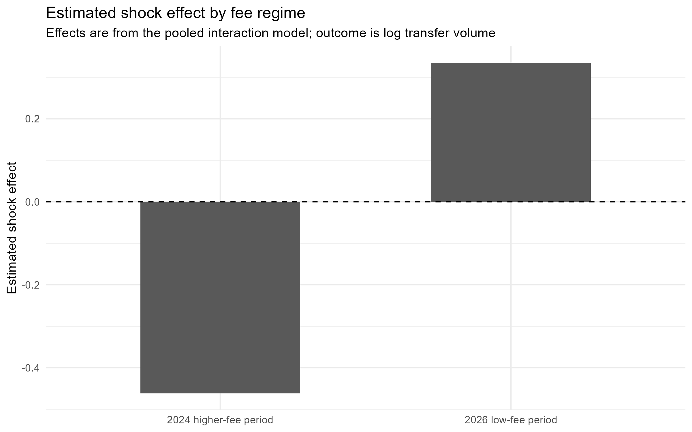

# Gas Stress Test AML

A comparative time-series pilot study of Ethereum gas fees and stablecoin transfer behaviour across two fee regimes.

This project explores whether Ethereum gas fees can be used as an interpretable behavioural signal for crypto-AML analytics. The analysis compares a historical higher-fee Ethereum period in August 2024 with a recent low-fee period in March–April 2026.

The project does **not** claim to identify illicit intent. Instead, it tests whether the meaning of gas-fee spikes changes depending on the broader fee environment.

---

## Project Motivation

In crypto-asset AML, interpretable behavioural features are important because risk indicators need to be explainable and auditable.

Ethereum gas fees may seem like a useful behavioural signal: if transaction costs become high, cost-sensitive users may delay or reduce transfers. However, gas fees also reflect network demand. Higher gas fees may therefore mean either:

1. more general network activity; or  
2. genuine transaction-cost pressure under extreme congestion.

This project asks whether the same gas-fee signal behaves differently across low-fee and higher-fee regimes.

---

## Research Questions

The project focuses on three questions:

1. Are Ethereum gas fees associated with stablecoin transfer volume into Dune-labelled `cex users` addresses?
2. Does this relationship differ between a higher-fee historical period and a recent low-fee period?
3. Can gas fees be treated as regime-dependent behavioural signals for crypto-AML modelling?

---

## Data

The data was extracted from Dune Analytics using the Dune API.

The unit of analysis is the hour.

The main variables are:

| Variable | Description |
|---|---|
| `cashout_volume_usd` | Hourly USD volume of USDC/USDT transfers into Dune-labelled `cex users` addresses |
| `transfer_count` | Number of transfers per hour |
| `avg_gas_gwei` | Hourly average Ethereum gas fee |
| `log_volume` | Log-transformed transfer volume |
| `log_gas` | Log-transformed gas fee |
| `shock` | Indicator for top-decile gas-fee hours within each period |

Transfers into `cex users` addresses are used as a proxy for exchange-related stablecoin transfer activity. This does **not** directly observe fiat cash-out.

---

## Fee Regimes Compared

| Period | Description | Observations |
|---|---|---:|
| August 2024 | Historical higher-fee window | 720 hourly observations |
| March–April 2026 | Recent low-fee window | 1200 hourly observations |

---

## Key Visuals

### Gas-fee distributions by period

The two periods represent clearly different fee environments. The 2024 period contains higher and more dispersed gas fees, while the 2026 period is concentrated at much lower fee levels.



---

### Hourly gas fees by period

The 2024 period contains a sharp gas-fee spike, while the 2026 period remains low-fee for most hours.



---

### Gas fees and stablecoin transfer volume

Continuous gas fees are positively associated with stablecoin transfer volume in both periods, suggesting that gas fees often capture general network activity rather than only transaction-cost pressure.



---

### Estimated shock effect by fee regime

The high-fee shock indicator changes direction across regimes. In the 2024 higher-fee period, top-decile gas hours are associated with lower transfer volume. In the 2026 low-fee period, top-decile gas hours are associated with higher transfer volume.



---

## Methods

The analysis uses three main steps:

### 1. Descriptive comparison

The two periods are compared using gas-fee levels, transfer volumes, and shock-hour counts.

### 2. Separate ARIMAX models

Separate ARIMAX models are estimated for each period to account for serial dependence in hourly transfer volumes.

The external regressors are:

- `log_gas`
- `shock`

### 3. Combined interaction model

A pooled OLS interaction model tests whether the gas-volume relationship differs across the two fee regimes.

This is **not** a formal Difference-in-Differences design, because there is no untreated control group or clearly defined policy intervention. It is best interpreted as a comparative time-series pilot study.

---

## Main Findings

The results suggest that Ethereum gas fees should not be interpreted mechanically.

### Finding 1: Continuous gas fees are positively associated with transfer volume

In both periods, higher continuous gas fees are associated with higher stablecoin transfer volume. This suggests that gas fees often reflect general network activity.

### Finding 2: The shock indicator behaves differently across regimes

In the higher-fee 2024 period, top-decile gas-fee hours are associated with lower transfer volume.

In the low-fee 2026 period, top-decile gas-fee hours are associated with higher transfer volume.

### Finding 3: Gas fees are regime-dependent behavioural signals

Gas fees may be useful for AML modelling, but only when interpreted within the wider fee environment.

In low-fee periods, gas-fee spikes may simply reflect normal network activity. In genuinely high-fee periods, extreme spikes may begin to operate as transaction-cost pressure.

---

## AML Interpretation

This project does not identify illicit addresses or prove criminal intent.

Its contribution is more cautious:

> Gas-fee-based AML features should be contextualised by fee regime before being interpreted as behavioural stress signals.

For future address-level AML modelling, this suggests a two-step design:

1. Identify whether the market is in a low-fee or high-fee regime.
2. During genuine high-fee stress periods, examine whether specific addresses show unusually weak cost responsiveness.

---

## Project Structure

```text
Gas-Stress-Test-AML/
├── data/
│   ├── raw/
│   │   └── 2024 daily Dune parquet files
│   ├── raw_2026/
│   │   └── 2026 daily Dune parquet files
│   ├── processed_2024/
│   │   └── dune_stablecoin_cex_hourly.csv
│   └── processed_2026/
│       └── dune_stablecoin_cex_hourly.csv
│
├── results_2026/
│   └── single-period 2026 model outputs
│
├── results_two_periods/
│   ├── figure1_gas_fee_distribution.png
│   ├── figure2_gas_fee_time_series.png
│   ├── figure3_gas_volume_relationship.png
│   ├── figure4_shock_effect_by_period.png
│   ├── arimax_residuals_high_fee_2024.png
│   ├── arimax_residuals_low_fee_2026.png
│   └── volume_by_period.png
│
├── scripts/
│   ├── fetch_dune_hourly.py
│   ├── process_2024_existing.py
│   ├── analysis_arimax.R
│   └── analysis_two_periods.R
│
└── README.md
